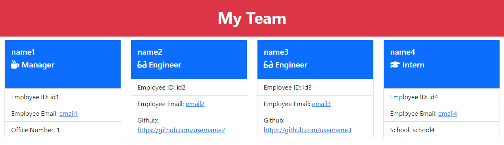

# Team Profile Generator

## Description 
This app can be used to quickly generate a responsive, styled, team profile html page. Each team member's name, role, and contact info will be desplayed on a card. Use this app anytime you curate a team for a new project!

## Table of Contents

1. [Installation](#installation)
2. [Usage](#usage)
3. [License](#license)
4. [Contributing](#contributing)
5. [Tests](#tests)
6. [Questions](#questions)

## Installation
Install node.js and npm. Then, clone this repo.

## Usage
Type "node index.js" in the terminal and you will be prompted with a series of questions about your team, starting with the team manager. You can keep adding engineers and interns until your team is complete. When you have entered information for every team member, select "I'm done". You will see an html appear in the "dist" folder. This is your team profile page! 

A video demo is linked here: https://drive.google.com/file/d/1bpiP0UugyX4340Z2yyjBwiGX-wWGPb3I/view

A screenshot from the demo is shown below:

## License
This application is covered under the MIT License.

## Contributing
This project is not actively accepting contributions at this time.

## Tests
Type "npm test" in the terminal and a series of tests will run.

A video demo showing how to run the tests is linked here: https://drive.google.com/file/d/1cA6p94El7yW74zFyNMexeM6w2Lusk0VL/view

## Questions
You can reach me with questions at rtc145@gmail.com or view my github page at https://github.com/Chillaroo.
    